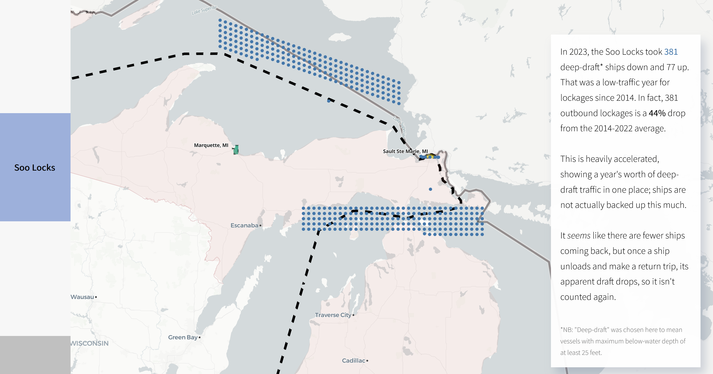

# US Iron Shipping on the Great Lakes: An Interactive Visualization Project

Riley Kouns

## Description

This project intends to recreate some of the incredulity I experienced when I first learned about how geographically concentrated iron mines are in the US. After coming to terms with that fact, the next question someone might ask is "Where does it all go?". I wanted to give a first pass at a sense of scale for this maritime shipping network that many people (in my circle, at least) didn't even really know existed. The sheer importance of the Soo Locks is one focus, with hundreds of ships and millions of tons relying on such a narrow passage. With how much time trade wars get in the headlines, it seems like investment in the infrastructure behind these commodities (steel, in this case) is not quite as catchy of a topic. I am just hoping that this topic somewhat enters the zeitgeist by the time the next spending bill comes around.

The visualization itself follows route typical of a Great Lakes bulk carrier from Duluth-Superior to Gary, Indiana in a "scrollytelling" format. Scrolling down progresses the voyage, displays some charts about ore tonnages by port, and highlights the deep-draft traffic through the Soo Locks on a "slow" year.

## Data Sources

*Arther M. Anderson* route: [Marine Cadastre](https://hub.marinecadastre.gov/pages/vesseltraffic)

Basetiles: OpenFreeMap © OpenMapTiles Data from OpenStreetMap

Great Lakes Port Statistical Areas: [USACE Geospatial Open Data](https://geospatial-usace.opendata.arcgis.com/datasets/b7fd6cec8d8c43e4a141d24170e6d82f_0/explore?location=34.833304%2C-97.027303%2C4.92)

Great Lakes Ports Cargo: U.S. Army Corps of Engineers Digital Library ["[2000-2022 Cargo] Manuscript cargo and trips data files, statistics on foreign and domestic waterborne commerce move on the United States waters"](https://usace.contentdm.oclc.org/digital/collection/p16021coll2/id/14572/rec/2)

Great Lakes Ports Trips: [USACE Ports and Waterways Page](https://ndc.ops.usace.army.mil/wcsc/webpub/#/)

US state borders: [https://github.com/PublicaMundi/MappingAPI/blob/master/data/geojson/us-states.json](https://github.com/PublicaMundi/MappingAPI/blob/master/data/geojson/us-states.json)

US-Canada border: 2023 TIGER/Line Shapefiles (US Census)